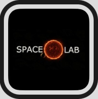

<!-- [![Contributors][contributors-shield]][contributors-url]
[![Forks][forks-shield]][forks-url]
[![Stargazers][stars-shield]][stars-url]
[![Issues][issues-shield]][issues-url]
[![MIT License][license-shield]][license-url]
[![LinkedIn][linkedin-shield]][linkedin-url] -->

<!-- PROJECT LOGO -->
 

  

<h3 align="center">Spacelab</h3>

  

    project_description
     
    <a href="https://github.com/spacelabdev/spacelab-react/blob/main/README.md"><strong>Explore the docs »</strong></a>
     
     
    <a href="http://spacelab.space/">View Pages</a>
  

### Welcome to Space Lab! 

New users starting out at spacelab will notice that we have multiple pages that can be accessed on our website. It may seem a little difficult to access the information on our website, but look no further, have hope! 
<!-- NAVIGATING TO OUR PAGES-->
  ### Our Pages

  To access our pages, you will navigate into sources folder --> pages; here lives most of our pages found on our website in code. 

  # About
  - The about page consists of our values, missions and vision here at SpaceLab. Here you will also meet our current teams and past-teams at SpaceLab.
  - It also contains a chronological time-line of SpaceLab's history which is valuable to those involved here at SpaceLab.
  
  # Resource
  - Inside of resource page, you will be able to see multiple navigations to projects, discovery, glossary and the podcast page. 
  - Here you can find information regarding what the main project of Spacelab is and our goals. 
  - Inside of discoveries you will find the most current discoveries here at Spacelab with regards to expoplanets. 
  - We also have a glossary page which contains all the appendixes and terminologies that one can head to learn more about the terminologies astronomers use everyday.
  - And our currently under construction Podcast (More info to be added soon!)

  # Blogs

  - Here you will find all of our featured blogs that our writing team have written and learned about throughout their investigation here at SpaceLab! 
  - Many of these articles are learning opportunities, or simply fun to read. 

  # Donate
  - As a non-profit 503c organization, we have a donation page setup to help fund SpaceLab. All donations made to the spacelab is used to improve the website as well as eventual funding of our interns here at SpaceLab!
  - You are free to donate as little or as much as you want-- all proceeds are invested back into the organization.
 
 # Contact

 - In this page you can contact us for any questions, inquires or others! 

<!-- LICENSE -->
## License

<!-- Distributed under the MIT License. See `LICENSE.txt` for more information. -->

(<a href="#top">back to top</a>)

<!-- CONTACT -->
## Contact

[Twitter](https://twitter.com/SpaceLab)  
[LinkedIn](https://www.linkedin.com/company/spacelab-space/) 
[Instagram](https://www.instagram.com/Spacelab) 
[Email](mailto:spacelabdev@gmail.com)

Project Link: [Spacelab](https://github.com/spacelabdev/spacelab-react)