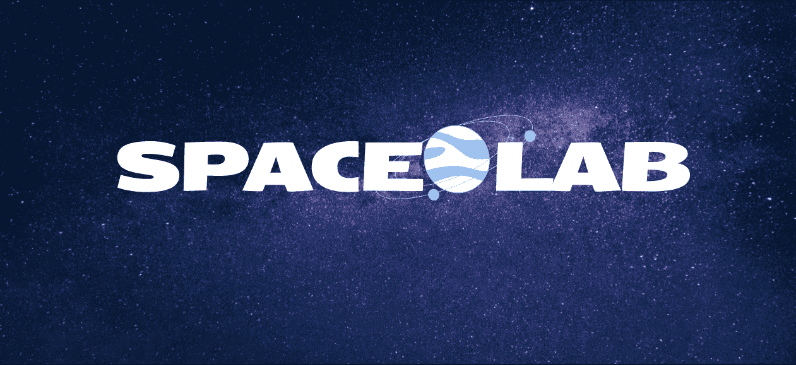

<!-- [![Contributors][contributors-shield]][contributors-url]
[![Forks][forks-shield]][forks-url]
[![Stargazers][stars-shield]][stars-url]
[![Issues][issues-shield]][issues-url]
[![MIT License][license-shield]][license-url]
[![LinkedIn][linkedin-shield]][linkedin-url] -->


<!-- PROJECT LOGO -->
<br />
<div align="center">
  <a href="https://github.com/spacelabdev/spacelab-react">
    
  </a>

<h3 align="center">Spacelab</h3>

  <p align="center">
    project_description
    <br />
    <a href="https://github.com/spacelabdev/spacelab-react/blob/main/README.md"><strong>Explore the docs »</strong></a>
    <br />
    <br />
    <a href="http://spacelab.space/">View Demo</a>
    ·
    <a href="https://github.com/spacelabdev/spacelab-react/issues">Report Bug</a>
    ·
    <a href="https://github.com/spacelabdev/spacelab-react/issues">Request Feature</a>
  </p>
</div>


<!-- TABLE OF CONTENTS -->
<details>
  <summary>Table of Contents</summary>
  <ol>
    <li>
      <a href="#about-the-project">About The Project</a>
      <ul>
        <li><a href="#built-with">Built With</a></li>
      </ul>
    </li>
    <li>
      <a href="#getting-started">Getting Started</a>
      <ul>
        <li><a href="#prerequisites">Prerequisites</a></li>
        <li><a href="#installation">Installation</a></li>
      </ul>
    </li>
    <li><a href="#usage">Usage</a></li>
    <li><a href="#roadmap">Roadmap</a></li>
    <li><a href="#contributing">Contributing</a></li>
    <li><a href="#license">License</a></li>
    <li><a href="#contact">Contact</a></li>
    <li><a href="#acknowledgments">Acknowledgments</a></li>
  </ol>
</details>


<!-- ABOUT THE PROJECT -->
## About The Project
<a href="https://github.com/spacelabdev/spacelab-react">
    
  </a>

  ### What is Spacelab
  Spacelab is a people-incubator drawing from diverse, underrepresented communities and with a goal of building the leaders of tomorrow through the creation of cross-functional outer-space-focused projects.

  Our first project uses Machine Learning and Deep Neural Networks to discover and classify exoplanets or planets that orbit stars other than our own sun. We are excited to be able to build on models that NASA Fellows and Scientists first created in prior programs with similar aims. 

  Our current project, the Exoplanetarium, focuses on using data from previous and current NASA satellite missions in a convolutional neural network to search for additional planetary candidates that went unclassified by NASA. Our volunteers come from different disciplines, including data scientists, front-end developers, WebGL developers, and back-end developers, who collaborate and use innovative problem-solving to find potential exoplanets. 

  ### Our Mission 
  Spacelab is building the next generation of leaders in outer-space-focused science and technology, drawing from diverse, underrepresented communities, including women, members of the LGBTQ+ community, and people of color, and creating paid fellowships, internships, and scholarship opportunities, as well as debt relief.


<!-- [![Product Name Screen Shot][product-screenshot]](https://example.com) -->

<!-- Here's a blank template to get started: To avoid retyping too much info. Do a search and replace with your text editor for the following: `github_username`, `repo_name`, `twitter_handle`, `linkedin_username`, `email`, `email_client`, `project_title`, `project_description` -->

<p align="right">(<a href="#top">back to top</a>)</p>


### Built With

* [React.js](https://reactjs.org/)
* [Node.js](https://nodejs.org/)
* [Bootstrap](https://getbootstrap.com)

<p align="right">(<a href="#top">back to top</a>)</p>


<!-- GETTING STARTED -->
## Getting Started

To get a local copy, follow these steps.

### Prerequisites

Make sure you have the latest `npm` package installed.
* npm
  ```sh
  npm install npm@latest -g
  ```

### Installation

1. Get a free API Key at [https://example.com](https://example.com)
2. Clone the repo
   ```sh
   git clone https://github.com/spacelabdev/spacelab-react
   ```
3. Install NPM packages
   ```sh
   npm install
   ```
4. Enter your API in `config.js`
   ```js
   const API_KEY = 'ENTER YOUR API';
   ```
5. To Run locally, you will need to use any node version >= 14 <= 16. Any other version you may receive an error. If you are using a mac you can install nvm to manage your node versions. (I suggest getting this if on Mac or Linux). For windows, there may be other node version managers, but I am not sure, so you may have to do some research. 
   ```sh
   nvm install 14
   nvm use 14
   ```

<p align="right">(<a href="#top">back to top</a>)</p>


<!-- USAGE EXAMPLES -->
## Usage

Use this space to show useful examples of how a project can be used. Additional screenshots, code examples and demos work well in this space. You may also link to more resources.

_For more examples, please refer to the [Documentation](https://example.com)_

<p align="right">(<a href="#top">back to top</a>)</p>


<!-- ROADMAP -->
<!-- ## Roadmap

- [ ] Feature 1
- [ ] Feature 2
- [ ] Feature 3
    - [ ] Nested Feature

See the [open issues](https://github.com/spacelabdev/spacelab-react/issues) for a full list of proposed features (and known issues).

<p align="right">(<a href="#top">back to top</a>)</p> -->


<!-- CONTRIBUTING -->
## Contributing

If you wish to become a contributor to the project, please [contact us](mailto:spacelabdev@gmail.com). Any contributions you make are **greatly appreciated**.

If you have a suggestion that would make this better, please fork the repo and create a pull request. You can also simply open an issue with the tag "suggestion".

1. Fork the Project
2. Create your Feature Branch (`git checkout -b feature/AmazingFeature`)
3. Commit your Changes (`git commit -m 'Add some AmazingFeature'`)
4. Push to the Branch (`git push origin feature/AmazingFeature`)
5. Open a Pull Request

<p align="right">(<a href="#top">back to top</a>)</p>


<!-- LICENSE -->
## License

<!-- Distributed under the MIT License. See `LICENSE.txt` for more information. -->

<p align="right">(<a href="#top">back to top</a>)</p>


<!-- CONTACT -->
## Contact

[Twitter](https://twitter.com/SpaceLab)<br /> 
[LinkedIn](https://www.linkedin.com/company/spacelab-space/)<br />
[Instagram](https://www.instagram.com/Spacelab)<br />
[Email](mailto:spacelabdev@gmail.com)

Project Link: [Spacelab](https://github.com/spacelabdev/spacelab-react)

<p align="right">(<a href="#top">back to top</a>)</p>


<!-- ACKNOWLEDGMENTS -->
## Acknowledgments

* []()
* []()
* []()

<p align="right">(<a href="#top">back to top</a>)</p>
